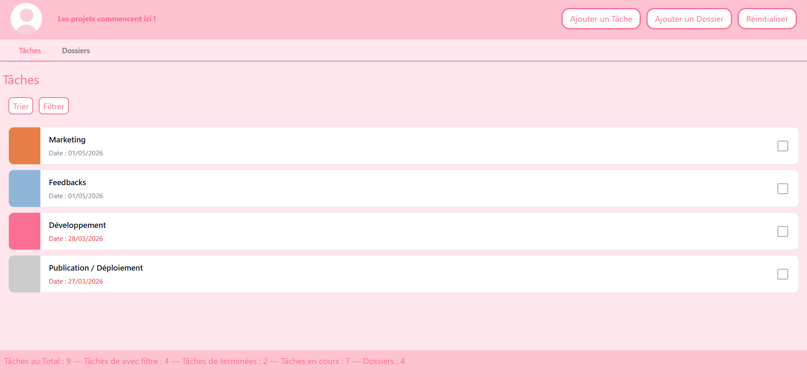
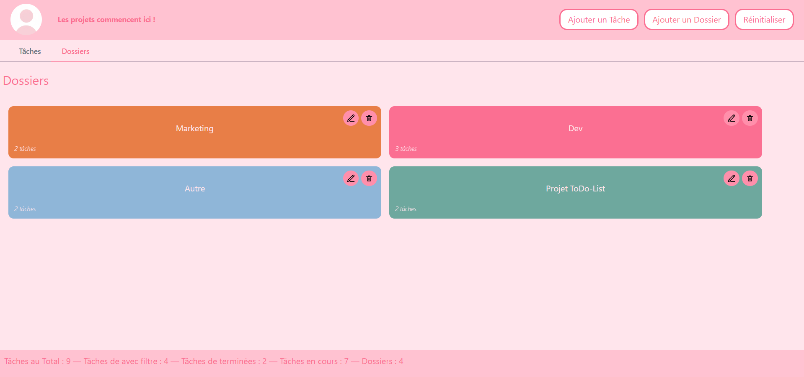
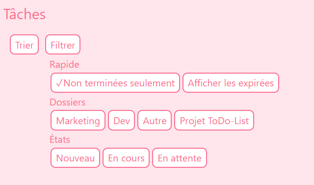

# ✧˖°  Ma Todo List °˖✧

Voici une application de gestion de tâches construite avec React. L'application permet d'organiser ses tâches par dossiers, de les filtrer, les trier et de suivre leur avancement.

---

## ✧˖° Présentation 

Ma TodoList est une application web développée en React. Elle permet de créer et gérer des tâches, de les regrouper dans des dossiers, et de naviguer facilement entre les taches grâce à des filtres. Les données sont enregistrer automatiquement dans le `localStorage` du navigateur.

---

## ✧˖° Installation

### Étapes

1. **Cloner le dépôt**

```bash
git clone https://github.com/Eloise-GIUSIANO-2024-2027/todo-list-eloise-giusiano.git
```

2. **Installer les dépendances**

```bash
npm install
```

3. **Lancer l'application**

```bash
npm start
```

L'application sera accessible sur [http://localhost:3000](http://localhost:3000).

---

## ✧˖° Fonctionnalités

### Tâches
- Affichage de toutes les tâches actives avec leur date d'échéance et dossier associé
- Marquer une tâche comme terminée (Réussi)
- Les tâches non terminées sont affichées par défaut au lancement

### Dossiers
- Organisation des tâches dans des dossiers 
- Création, renommage et suppression de dossiers
- Affichage du nombre de tâches par dossiers

### Filtres
- **Non terminées seulement** — permet de choisir si on veut afficher les taches finis ou non 
- **Afficher les expirées** — affiche les tâches dont la date d'échéance dépasse 1 semaine
- Filtrage par **dossier** et par **état** (Nouveau, En cours, En attente…)

### Tris
- Par **date d'échéance** 
- Par **date de création**
- Par **nom** (alphabétique)

### Statistiques
- Nombre total de tâches
- Nombre de tâches actuellement affichées (selon les filtres)
- Nombre de tâches terminées
- Nombre de tâches en cours
- Nombre de dossiers

### Données
- Sauvegarde automatique dans le `localStorage`
- Au lancement, proposition de restaurer les données précédentes ou de repartir de zéro

---

## ✧˖° Captures d'écran

**Vue Tâches**



**Vue Dossiers**




**Menu Filtres**



---

## ✧˖° Auteure
 
**Éloïse Giusiano** — [GitHub](https://github.com/Eloise-GIUSIANO-2024-2027)